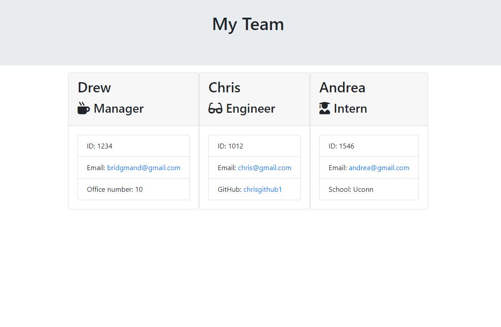

# Employee-Summary

## Description

This application uses the command-line to dynamically generate an HTML file from a user's input using the Inquirer package.  The first prompt will ask you to pick which team member you would like to add.  You will then be asked specific about the employee type that you picked.  Once you are finished adding members to the team and their individual details an HTML file will be dynamically created.  

## Developer 
 
 

Link to Walkthrough Video: [Employee Summary Generator](https://drive.google.com/drive/folders/17nDCfFI4kBFiwPOxToqxRuMrSzG6QH_J)

## Fucntionality

## Bugs and Issues
Found a bug? Review any [open issues][open-issues] or create a [new issues here][new-issue] so we can fix it for you!

## License
This application does not hold any licenses.

[open-issues]: https://github.com/dbridgman1/Employee-Summary/issues
[new-issue]: https://github.com/dbridgman1/Employee-Summary/issues/new